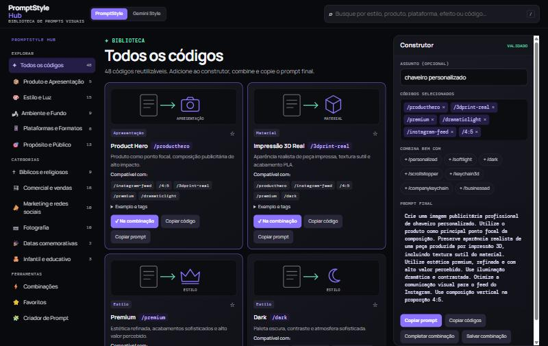
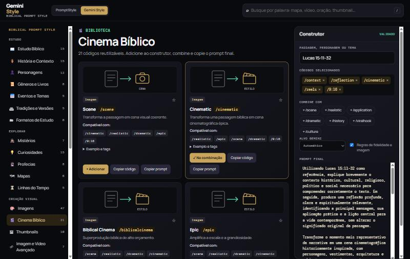

<div align="center">

# PromptStyle

**Bibliotecas de códigos de prompt para IA, com construtor, busca inteligente e combinações prontas.**

Monte prompts completos e consistentes para imagens, vídeos, narração e conteúdo bíblico clicando em blocos reutilizáveis (`/premium`, `/cinematic`, `/9:16`…).

[](https://mpjservice.com/promptstyle/)
[](LICENSE)


[**Abrir o PromptStyle Hub**](https://mpjservice.com/promptstyle/) · [**Abrir o Gemini Style**](https://mpjservice.com/promptstyle/gemini-style.html)

</div>

---

## Sumário

- [Visão geral](#visão-geral)
- [Capturas de tela](#capturas-de-tela)
- [Funcionalidades](#funcionalidades)
- [As duas bibliotecas](#as-duas-bibliotecas)
- [Como funciona](#como-funciona)
- [Começando](#começando)
- [Arquitetura](#arquitetura)
- [Como expandir](#como-expandir)
- [Publicação](#publicação)
- [Privacidade e dados](#privacidade-e-dados)
- [Ideias futuras](#ideias-futuras)
- [Autoria e licença](#autoria-e-licença)

---

## Visão geral

O **PromptStyle** transforma códigos curtos em prompts completos. Cada código é um **bloco reutilizável** (por exemplo `/cinematic` ou `/instagram-feed`) com descrição, texto de prompt, tags de busca, códigos compatíveis, exemplos e uma ilustração que mostra o que ele faz. Você combina vários blocos e o sistema gera **um único prompt coerente**, não uma simples colagem de textos.

O projeto reúne duas bibliotecas no mesmo modelo de interface e de arquitetura:

| Biblioteca | Para quê | Tamanho |
|---|---|---|
| **PromptStyle Hub** | Imagens publicitárias com IA: produto, marketplace, marketing, fotografia, infantil, datas comemorativas | 48 presets · 8 receitas |
| **Gemini Style** (*Biblical Prompt Style*) | Conteúdo bíblico e cristão: estudo, história, personagens, imagens, cinema, vídeos, shorts, reels, narração, sermões, devocionais, thumbnails | 232 códigos · 31 categorias · 33 combinações |

É um **site 100% estático**: sem servidor, sem build e sem dependências. Abre em qualquer navegador.

## Capturas de tela

**PromptStyle Hub**



**Gemini Style**



## Funcionalidades

**Biblioteca**
- Cards com **ilustração**, descrição, categoria, códigos compatíveis, exemplos de entrada/saída, tags e o prompt-base de cada código.
- Menu lateral organizado por grupos (Estudo, Explorar, Criação visual, Vídeo e voz, Mensagens, Ajustes, Ferramentas).
- **Busca inteligente** por palavra relacionada, sem diferenciar acentos: pesquisar “mapa” encontra `/map`, `/journey`, `/geography`, `/place`; pesquisar “vídeo” encontra os roteiros e narrações.

**Construtor de prompt**
- Passagem, assunto ou tema + códigos selecionados → **prompt final coerente** (tarefas na ordem certa, parágrafo visual, composição e regras).
- Digite tudo em uma linha, como `Davi contra Golias /cinematic /epic /9:16`, e o sistema interpreta.
- Sugestões **“Combine com”** baseadas nos códigos escolhidos.
- Botões de **copiar código**, **copiar prompt** e **copiar lista de códigos**.

**Criação assistida**
- **Criar para mim:** descreva em linguagem natural (“Quero um Reels sobre Daniel na cova dos leões”) e o sistema escolhe os códigos.
- **Construtor guiado:** escolha fonte, objetivo, tipo, estilo e formato e receba a sequência recomendada.
- **Combinações prontas** para os casos mais comuns, mais o modo **Canal Dark** (Gemini Style).

**Seu espaço**
- **Favoritos** de códigos e combinações.
- **Combinações próprias:** criar, editar, duplicar e excluir.
- Tudo é salvo no seu navegador (`localStorage`).

**Qualidade**
- Regras de **fidelidade bíblica**, de **imagem** e de **personagens** aplicadas automaticamente no Gemini Style.
- Regras de **exclusividade** e **conflito** no Hub (um formato, uma plataforma, um fundo por vez).
- Interface responsiva (celular, tablet e desktop), com menu e construtor em painéis deslizantes no celular.
- Alvo de saída para o Gemini: texto, imagem ou vídeo (Veo).

## As duas bibliotecas

### PromptStyle Hub

Presets visuais com **papel funcional** (propósito, assunto, apresentação, material, estilo, iluminação, efeito, ambiente, fundo, promoção, plataforma, marketplace, formato e público). A **ordem do clique não altera o resultado**: o prompt segue a ordem canônica dos papéis.

- **Menu:** Todos os códigos · Produto e Apresentação · Estilo e Luz · Ambiente e Fundo · Plataformas e Formatos · Propósito e Público · Bíblicos e religiosos · Comercial e vendas · Marketing e redes sociais · Fotografia · Datas comemorativas · Infantil e educativo · Combinações · Favoritos · Criador de Prompt.
- **Regras:** formato, plataforma, marketplace e fundo são exclusivos (o novo substitui o anterior); conflitos de fundo (`/whitebg`, `/blackbg`, `/transparent`) são bloqueados; **“Completar combinação”** consulta somente receitas pré-validadas.

### Gemini Style — Biblical Prompt Style

Um *Biblical Content Engine*: de uma simples passagem (por exemplo “Êxodo 14”) para estudo, cena, short, reels, documentário, mapa, linha do tempo, sermão, devocional, thumbnail e prompts de imagem, vídeo e voz.

| Grupo | Categorias |
|---|---|
| **Estudo** | Estudo Bíblico · História e Contexto · Personagens · Gêneros e Livros · Eventos e Temas · Tradições e Versões · Formatos de Estudo |
| **Explorar** | Mistérios · Curiosidades · Profecias · Mapas · Linhas do Tempo |
| **Criação visual** | Imagens · Cinema Bíblico · Thumbnails · Imagem e Vídeo Avançado |
| **Vídeo e voz** | Vídeos · Narração · Redes Sociais · Plataformas |
| **Mensagens** | Sermões · Devocionais · Ocasiões |
| **Ajustes** | Público · Tom · Fidelidade · Idioma e Saída |
| **Ferramentas** | Combinações · Canal Dark · Favoritos · Criador de Prompt |

Códigos de produção completa: `/fullvideo`, `/fullshort`, `/fullreels`, `/fulldocumentary`, e geradores `/imageprompt`, `/videoprompt` e `/voiceprompt`.

## Como funciona

### Exemplo — Gemini Style

Entrada:

```text
Lucas 15:11-32 /context /reflection /cinematic /reels /9:16
```

Saída (resumida):

> Utilizando Lucas 15:11-32 como referência, explique brevemente o contexto histórico, cultural, religioso, político e social necessário para compreender corretamente o texto. Em seguida, produza uma reflexão profunda, clara e espiritualmente relevante…
>
> Transforme o momento mais representativo da narrativa em uma cena cinematográfica historicamente inspirada, com personagens, vestimentas, arquitetura e ambiente compatíveis com a época e o local descritos. Utilize composição cinematográfica épica, realista e emocionalmente impactante.
>
> A composição deverá ser vertical 9:16 e otimizada para Instagram Reels, com ponto focal claro e espaço adequado para inserção de texto.
>
> *Regras de fidelidade bíblica, de imagem e de personagens são anexadas ao final.*

### Exemplo — PromptStyle Hub

Entrada:

```text
chaveiro personalizado /producthero /3dprint-real /premium /instagram-feed /4:5
```

Saída:

> Crie uma imagem publicitária profissional de chaveiro personalizado. Utilize o produto como principal ponto focal da composição. Preserve aparência realista de uma peça produzida por impressão 3D… Utilize estética premium, refinada e com alto valor percebido. Otimize a comunicação visual para o feed do Instagram. Use composição vertical na proporção 4:5.

### Como o prompt é montado (Gemini Style)

1. **Tarefas de texto** (gancho, análise, narrativa, voz…) em ordem de fase, com conectores (“Em seguida”, “Por fim”).
2. **Parágrafo visual**: cena principal + estilos combinados em uma frase.
3. **Composição**: proporção e plataforma (por exemplo vertical 9:16 para Reels) e espaço para texto quando necessário.
4. **Ajustes** de público, tom, idioma e saída.
5. **Regras globais** de fidelidade bíblica, imagem e personagens (opcionais).

## Começando

Não há nada para instalar.

**Usar online:** [mpjservice.com/promptstyle](https://mpjservice.com/promptstyle/)

**Rodar localmente:**

```bash
git clone https://github.com/kayonarah/promptstyle.git
cd promptstyle/dist
python -m http.server 8000
# abra http://localhost:8000
```

(Qualquer servidor estático serve.)

## Arquitetura

```text
dist/
├── index.html              PromptStyle Hub (tema violeta)
├── gemini-style.html       Gemini Style (tema dourado)
├── .htaccess               política de segurança (CSP) para Apache
├── core/                   NÚCLEO COMPARTILHADO
│   ├── app.js              interface: menu, cards, construtor, busca, favoritos, combinações
│   ├── illus.js            ilustrações SVG por código (motivos reutilizáveis)
│   └── style.css           estilos e temas
├── promptstyle/            BIBLIOTECA 1
│   ├── presets.js          dados originais (presets e receitas)
│   ├── data.js             catálogo no formato padrão
│   └── engine.js           motor: ordem canônica, exclusividade, conflitos, completar
└── gemini/                 BIBLIOTECA 2
    ├── data.js             232 códigos, menu, combinações, regras globais
    └── engine.js           motor: parser, composição, busca, recomendação, "criar para mim"
docs/img/                   capturas de tela deste README
.github/workflows/          publicação automática na Hostinger
```

**Contrato entre as camadas.** Cada `engine.js` publica `window.GS_LIB = { id, D, G, ui }`:

- `D` — dados (`CODES`, `VIEWS`, `COMBOS`, `byCode`);
- `G` — motor (`parseInput`, `add`, `normalize`, `compose`, `search`, `recommend`, `createForMe`, `guided`…);
- `ui` — textos e recursos da página.

O `core/app.js` conhece **somente** esse contrato. Para criar uma terceira biblioteca basta um `data.js`, um `engine.js` e uma página HTML nova.

**Formato de cada código:**

```json
{
  "code": "/cinematic",
  "name": "Cinematic",
  "category": "Imagem",
  "description": "Transforma uma passagem bíblica em cena cinematográfica épica.",
  "prompt": "Crie uma representação cinematográfica épica…",
  "tags": ["cinema", "épico", "filme"],
  "compatibleWith": ["/realistic", "/epic", "/scene", "/9:16"],
  "examples": [{ "input": "Davi contra Golias /cinematic /epic /9:16", "output": "…" }],
  "featured": true
}
```

## Como expandir

| Quero… | Faça |
|---|---|
| Novo preset do Hub | Adicione uma linha em `dist/promptstyle/presets.js` |
| Novo código bíblico | Adicione uma linha em uma seção de `dist/gemini/data.js` (`SECTIONS`) |
| Nova categoria no menu | Adicione um item em `VIEWS` e use o `id` nos códigos |
| Nova combinação pronta | Adicione em `COMBOS` (ou `DARK_COMBOS`) |
| Ilustração para um código | Mapeie o código a um motivo em `dist/core/illus.js` (ou crie um motivo novo) |
| Nova biblioteca | Crie `data.js` + `engine.js` + uma página HTML e defina `GS_LIB` |

## Publicação

O site é estático; basta servir a pasta `dist/`.

**Automático (Hostinger).** O fluxo [`deploy-hostinger.yml`](.github/workflows/deploy-hostinger.yml) envia `dist/` por FTP seguro a cada *push* na `main`. Ele depende de três segredos do repositório: `FTP_SERVER`, `FTP_USERNAME` e `FTP_PASSWORD`. Sem eles, o fluxo termina sem publicar.

**Manual.** Envie o conteúdo de `dist/` para a pasta desejada do seu servidor.

## Privacidade e dados

- Não há servidor, cadastro, anúncios nem rastreamento no código.
- Favoritos, combinações próprias e o último estado do construtor ficam apenas no `localStorage` do seu navegador.
- A única requisição externa é a das fontes do Google Fonts.

## Ideias futuras

- Exportar e importar favoritos e combinações próprias.
- Mais ilustrações específicas por código.
- Novas bibliotecas (por exemplo conteúdo educacional ou de saúde) usando o mesmo núcleo.
- Testes automatizados para os motores de composição.

## Autoria e licença

© 2026 [kayonarah](https://github.com/kayonarah).

Código aberto para **consulta e compartilhamento com crédito**, licenciado sob [CC BY-ND 4.0](LICENSE) ([resumo](https://creativecommons.org/licenses/by-nd/4.0/deed.pt-br)): você pode copiar e redistribuir citando o autor, mas **não é permitido publicar versões modificadas**. Somente o autor altera este repositório.
